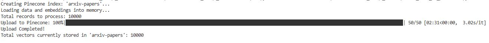
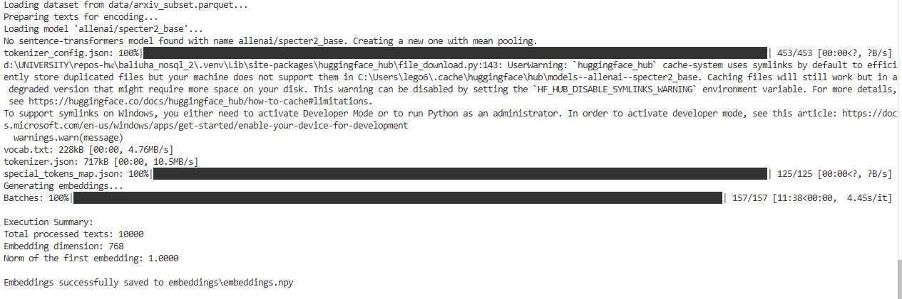
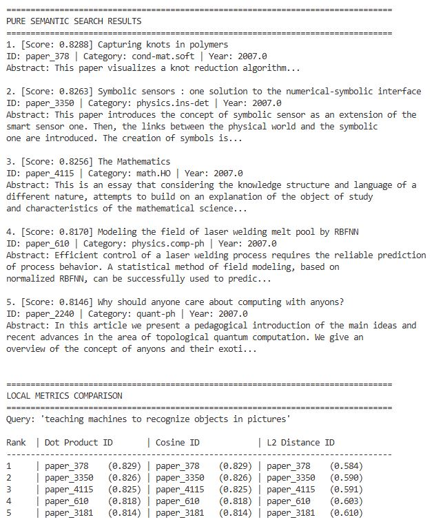
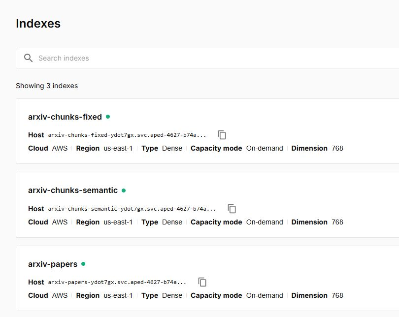
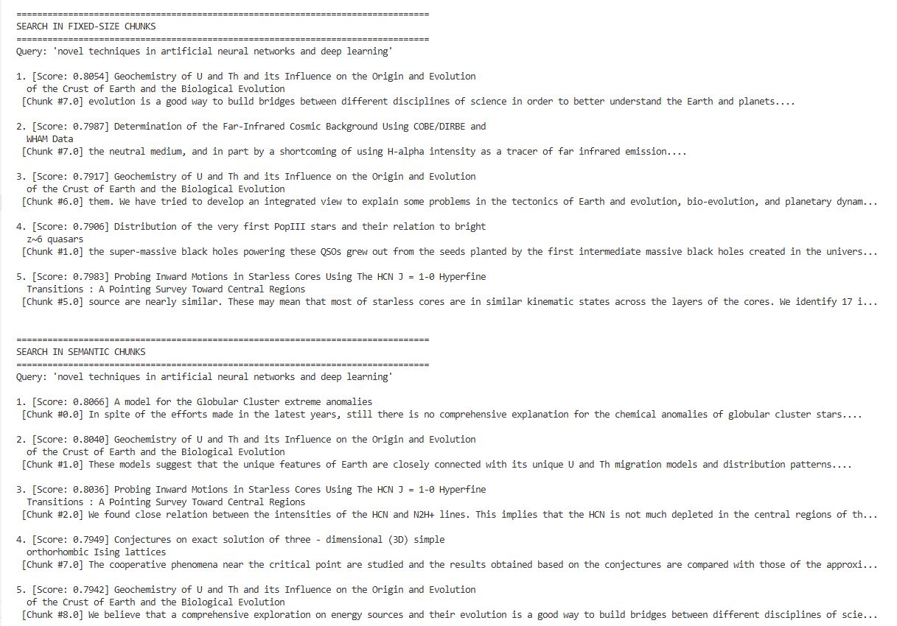
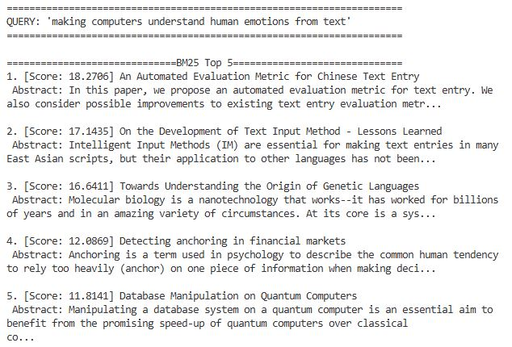
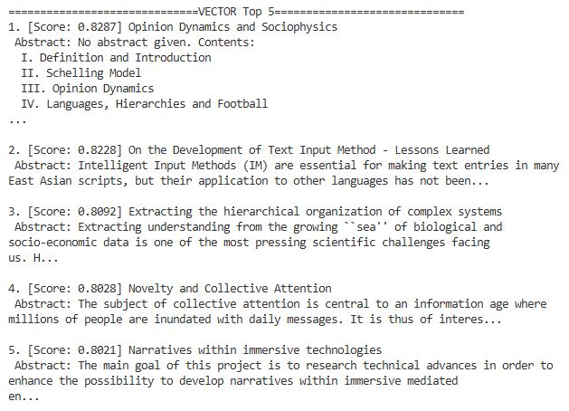
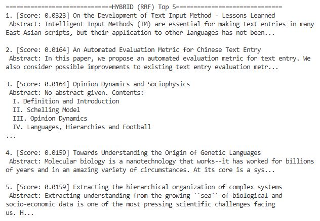

# NoSQL HW 2

### Відповіді на теоретичні питання (Частина 1: Підготовка даних та вибір інструментів)

**1. Порівняння Pinecone, Qdrant та Chroma**

* **Pinecone** повністю керована векторна база даних із закритим вихідним кодом, що надається виключно як SaaS-рішення. Вона пропонує автоматичне масштабування без необхідності обслуговувати інфраструктуру, що робить її хорошим вибором для проєктів, де команда хоче уникнути витрат на DevOps
* **Qdrant** база даних із відкритим вихідним кодом (Apache 2.0), написана на Rust. Вона пропонує різні моделі розгортання: як керований хмарний сервіс або повністю self-hosted на власних серверах. Qdrant підходить для проєктів, які вимагають суворої конфіденційності даних (розміщення на внутрішніх серверах) або складного гібридного пошуку
* **Chroma** також має відкритий код (Apache 2.0), але в першу чергу створена для зручності та простоти використання. Вона часто працює прямо в оперативній пам'яті або як локальна бібліотека. Це хороший вибір для швидкого прототипування, хакатонів, локальної розробки або невеликих застосунків, де не потрібна важка інфраструктура

**2. Чому обрано `specter2_base`, а не `all-MiniLM-L6-v2`**

Модель `all-MiniLM-L6-v2` є моделлю загального призначення, навченою на масиві повсякденних текстів (Вікіпедія, Reddit, загальні дані). Хоча вона підходить для базового семантичного пошуку, їй бракує глибокого розуміння наукової термінології та академічного контексту. Натомість `allenai/specter2_base` була спеціально навчена на наукових текстах. Згідно з карткою моделі на [HuggingFace](https://huggingface.co/allenai/specter2_base): 
>SPECTER2 has been trained on over 6M triplets of scientific paper citations, which are available [here](https://huggingface.co/datasets/allenai/scirepeval/viewer/cite_prediction_new/evaluation).
>
>Task Formats trained on:
>* Classification
>* Regression
>* Proximity (Retrieval)
>* Adhoc Search

**3. Рекомендована метрика схожості та її важливість**

Для моделей Specter рекомендованими метриками схожості є Cosine Similarity або Dot Product. Це важливо враховувати під час створення індексу у Pinecone. База даних повинна обчислювати відстань між векторами за тією ж математичною логікою, за якою нейромережа їх оптимізувала під час навчання. Якщо обрати іншу метрику, геометричний простір спотвориться, що призведе до падіння точності пошуку та видачі нерелевантних результатів

**4. Чому косинусна схожість еквівалентна скалярному добутку для нормалізованих векторів**

Косинусна схожість між двома векторами $A$ та $B$ обчислюється за такою математичною формулою:
$$\text{Cosine}(A, B) = \frac{A \cdot B}{||A|| \times ||B||}$$
де $A \cdot B$ — це скалярний добуток (dot product), а $||A||$ та $||B||$ — фізичні довжини (магнітуди) цих векторів.

Коли ми нормалізуємо ембеддинги під час їх створення (використовуючи параметр `normalize_embeddings=True`), ми застосовуємо L2-нормалізацію. Це означає, що ми примусово зводимо довжину кожного вектора рівно до одиниці. Тобто:
$$||A|| = 1$$
$$||B|| = 1$$

Якщо підставити ці значення у вихідну формулу, знаменник перетворюється на одиницю і зникає:
$$\text{Cosine}(A, B) = \frac{A \cdot B}{1 \times 1} = A \cdot B$$

Оскільки результати стають математично ідентичними, векторні бази даних рекомендують використовувати скалярний добуток для нормалізованих векторів. Обчислення скалярного добутку вимагає менше процесорного часу.

### Відповіді на теоретичні питання (Частина 3: Пошук та метрики)

**1. Чи збігаються топ-5 для cosine і dot product і чому?**

Так, вони збігаються тому, що під час генерації ембеддингів ми застосували L2-нормалізацію `normalize_embeddings=True`, яка зробила довжину всіх векторів у базі (та вектора запиту) рівною 1. Оскільки знаменник у формулі косинусної схожості — це добуток довжин векторів, формула $\frac{A \cdot B}{||A|| \times ||B||}$ математично скорочується до скалярного добутку $A \cdot B$

**2. Чи відрізняються результати для L2 і чому?**

Ні, результати для L2-відстані (Евклідової відстані) також збігатимуться. Хоча L2 шукає мінімальну відстань (чим менше, тим краще), а косинус шукає максимальну схожість, для нормалізованих векторів між ними існує математична залежність: 
$$||A - B||^2 = ||A||^2 + ||B||^2 - 2(A \cdot B)$$
Оскільки $||A||=1$ та $||B||=1$, формула перетворюється на $2 - 2(A \cdot B)$. Тобто мінімізація L2-відстані є еквівалентною максимізації скалярного добутку

**3. Що сталося б, якби ембеддинги не були нормалізовані?**

Якби ми вимкнули нормалізацію, результати б розійшлися:
* **Dot Product** почав би видавати нерелевантні результати. Він чутливий до довжини вектора. Довга стаття (з великою магнітудою вектора) отримала б вищий бал, ніж коротка
* **L2-distance** також працювала б погано, групуючи статті за їхнім розміром/лексичною насиченістю, а не за тематикою
* **Cosine Similarity** була б єдиною метрикою, яка продовжила б працювати правильно, оскільки вона вимірює виключно кут між векторами, ігноруючи їхню довжину

### Відповіді на теоретичні питання (Частина 4: Chunking)

**1. Яка стратегія дає більш осмислені чанки?**

Більш осмислені чанки дає Semantic chunking, стратегія враховує структуру людської мови (крапки, розділові знаки) і намагається тримати завершені думки разом

**2. Чи є випадки розрізаних речень і як це впливає на ембеддинги?**

Так, у стратегії Fixed-size chunking речення регулярно розрізаються навпіл. Це негативно впливає на ембеддинги через втрату контексту та генерацію "сміттєвих" векторів (чанк, який починається з обривку фрази, може змістити вектор у неправильний смисловий простір)

**3. Як розмір overlap (перекриття) впливає на кількість чанків і покриття тексту?**
* Вплив на кількість: Чим більший overlap, тим повільніше проходить вікно по тексту, загальна кількість згенерованих чанків зростає. Це призводить до більших витрат пам'яті і дорожчих розрахунків (потрібно проганяти через модель більше векторів)
* Вплив на покриття тексту: Великий overlap є воркераундом для проблеми розрізаних речень у Fixed-size chunking. Він гарантує високе покриття сенсу, це підвищує шанси пошукової системи знайти правильну відповідь, навіть якщо текст був розірваний неакуратно

### Відповіді на теоретичні питання (Частина 5: Гібридний пошук)

**1. Який метод дав кращий результат і чому?**

Найкращий результат показав гібридний пошук (RRF). Він об'єднує сильні сторони обох підходів: здатність BM25 точно знаходити специфічні терміни чи імена (наприклад, "BERT" або "Yann LeCun") та вміння векторного пошуку розуміти загальний семантичний контекст. Це дозволяє виводити на перші місця статті, які відповідають запиту за обома критеріями одночасно

**2. Чи є документи в топ-5 гібридного пошуку, яких немає в топ-5 окремих методів, і чому?**

Так, є (стаття "Optimization in Gradient Networks"). Це пов'язано з тим, що алгоритм RRF підсумовує бали документів із ширшої вибірки. Якщо стаття стабільно займає середні позиції (наприклад, 6-те місце) і у векторному, і в лексичному пошуку, її сумарний бал перевершить оцінку документа, який був лідером в одному методі, але знаходився на дні в іншому. RRF винагороджує стабільність

**3. Як зміна параметра k в RRF впливає на видачу (наприклад, k=60 vs k=1)?**

Формула RRF виглядає так: $\text{Score} = \frac{1}{k + \text{rank}}$
Параметр k згладжує різницю в балах між рейтинговими позиціями:
* При k=60 (баланс): Штраф за нижчу позицію є мінімальним. Це дозволяє документам із стабільними середніми позиціями в обох списках накопичити бали та вийти в загальний топ
* При k=1 (екстремум): Штраф різко зростає. Алгоритм втрачає здатність до компромісу, і гібридна видача перетворюється на просте чергування абсолютних лідерів з обох методів,  ігноруючи решту стабільних результатів

### Частина 6 — Аналіз і висновки

**1. Семантичний пошук vs BM25**
У нашій роботі BM25 виграв на запитах, що містили точні сутності: "Yann LeCun convolutional networks" та "BERT fine-tuning", оскільки він спирається на частоту точних збігів термінів (TF-IDF) і не розмиває власні імена чи абревіатури. Натомість семантичний (векторний) пошук переміг на запиті "making computers understand human emotions from text", де не було специфічних термінів, але був загальний сенс. 
BM25 слід використовувати для пошуку за ідентифікаторами, абревіатурами, іменами та специфічним сленгом. Семантичний пошук є оптимальним для пошуку за сенсом, відповідей на запитання (Q&A), перефразувань та довгих описових запитів.

**2. Вплив розміру чанка**
Якщо чанк занадто маленький (10–15 слів), він втрачає глобальний контекст. Вектор такого чанка стає семантично бідним, що призводить до великої кількості хибнопозитивних результатів (модель знаходить збіг слів, але не сенсу). Якщо чанк занадто великий (500+ слів), відбувається розмиття: усереднений вектор втрачає специфічність деталей, оскільки в одному масиві змішано занадто багато різних концепцій, а також виникає ризик обрізання тексту лімітами моделі. 
Оптимальни розмір залежить від задачі. Для точного вилучення фактів кращі малі чанки (100–200 токенів), для загального підсумовування — великі чанки або документи.

**3. Невідповідна метрика**
Якби ми створили індекс із метрикою L2, але використовували L2-нормалізовані вектори, якість результатів не змінилася б взагалі. Топ-5 документів та їхній порядок залишилися б абсолютно ідентичними до видачі метрики Cosine або Dot Product, змінилася б лише шкала оцінок. Математично для двох одиничних векторів $A$ та $B$, де $||A||=1$ та $||B||=1$, Евклідова відстань у квадраті виражається як:

$$||A - B||^2 = ||A||^2 + ||B||^2 - 2(A \cdot B)$$

Підставляючи довжини, отримуємо:

$$||A - B||^2 = 2 - 2(A \cdot B)$$

З формули видно, що мінімізація L2-відстані є математично еквівалентною максимізації скалярного добутку або косинусної схожості.

**4. Обмеження Pinecone Starter**
У безкоштовному тарифі Pinecone Starter головними обмеженнями є ліміт на кількість проектів та індексів, обмежена кількість запитів в секунду та ліміт на кількість збережених векторів. Для виконання завдання це не було проблемою, але відчутним лишається обмеження в 40 KB на метадані одного вектора. Через це довелось обрізати повні тексти статей під час завантаження. 

Олнак, для масштабування до 10 мільйонів статей тариф Starter не підійде через брак пам'яті. Вирішенням було б: 
1) Перехід на платну архітектуру Pinecone Serverless; 
2) Міграція на self-hosted open-source векторні бази (Qdrant, Milvus), розгорнуті на власних серверах; 
3) Використання методів стиснення векторів (Product Quantization) або зменшення їх розмірності (PCA) для економії оперативної пам'яті